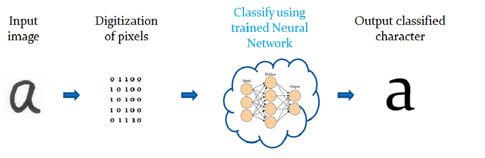

### Yapay Sinir Ağları
Yapay sinir ağları, insan beyninin özelliklerinden olan öğrenme yolu ile yeni bilgiler türetebilme, yeni bilgiler oluşturabilme ve keşfedebilme gibi yetenekleri herhangi bir yardım almadan otomatik olarak gerçekleştirmek amacı ile geliştirilen bilgisayar sistemleridir. Yapay sinir ağları, olayların örneklerine bakmakta onlardan ilgili olaya hakkında genellemeler yapmakta, bilgiler toplamakta ve daha sonra hiç görmediği örnekler ile karışılışınca öğrendiği bilgileri kullanarak o örnekler hakkında karar verebilmektedir.

### Karakter Tanıma
Karakter tanıma görüntüler üzerindeki karakterlerin ya da metin bilgilerinin okunarak işlenmesi olduğundan bu işlem için çeşitli görüntülerin veya metinlerin bilgisayar tarafından işlenebilecek sayısal veriler haline dönüştürülmesi gerekmektedir. 

Karakter tanıma işlemi 3 ana bölümden oluşur:

1. Pre-processing (Ön İşleme)
2. Feature Extraction (Özellik Çıkarımı)
3. Yapay Sinir Ağı (ANN) modelleme

### Ön İşleme
Görüntü işleme, nesnenin görüntüsünü işleyerek istenilen özelliklerin çıkarılmasına zemin hazırlanması aşamasıdır. Görüntü işleme ile veriler amaca uygun bir hale getirilir. 

Aşağıdaki ön-işleme yöntemleri, karakter tanıma yazılımında yaygın olarak kullanılır: 

1. Binarisation: Resim, öğrenme algoritmasının hesaplama gücünü azaltmak için ikili (siyah-beyaz) formata dönüştürülür. Eşik piksel değeri seçildi. Daha yüksek pikseller siyah olarak atandığında, bu değerin altındaki pikseller beyaz bölgeler olarak kabul edilir.

2. Thinning: Kenar algılama “Görüntüdeki süreksizlikleri ve keskin (hızlı) tonlama değişikliklerini bulma işlemidir” algoritması kullanılarak, karakterin genişliği 1 piksele indirgenir. Bu durum, karakterlerin üniform hale getirilmesi ve fazlalığı azaltmaya yardımcı olur.

3. Normalisation: Bir karakterin konumu, özelliği ve boyutu, seçilen şablona göre normalleştirilir.

### Özellik Çıkarımı
Görüntüden renk ve şekil gibi yüksek düzeyde bilgilerin çıkarılmasını içerir. Ön işleme tabi tutulan görüntü, boyutsal olarak azaltılmış gösterime dönüştürülür. Ön işlemeden alınan görüntünün her bir kutucuğun değerini belirlemek için ikinci bir threshold yapılır. Böylece elimizde ağ için uygun bir giriş elde edilmiş olur. 

### Yapay Sinir Ağı Modelleme
Öğrenme süreci, istenen amaca ulaşmak için YSA ağırlıklarının yenilenmesini sağlayan öğrenme algoritmalarını gerçekleştirir. Yapay sinir ağı için öğrenme işlemi, ağırlıkların en iyi değerinin bulunmasıdır. Yapay   sinir   ağlarında   bilgi,   ağdaki   sinirlerin      bağlantılarının ağırlıklarında tutulur. Tüm ağdaki ağırlıklar optimal değerler almalıdır. Bu ağırlıklara ulaşılabilmesi için yapılan isleme “ağın eğitilmesi” denir. Yapay sinir ağı modellemede en sık kullanılan yöntem geri yayılım (backpropagation) algoritmasıdır. Geri Yayılım, ileri beslemeli çok katmanlı ağın eğitiminde kullanılan denetlenmiş bir öğrenme algoritmasıdır.

1. Giriş Katmanı: Bu katmandaki işlem elemanları, dışardan bilgileri alarak bir sonraki katman olan ara katmanlara transfer ederler.

2. Ara (Gizli) Katman: Giriş katmanından gelen bilgiler islenerek çıkış katmanına gönderilirler. Ara katman sayısı ağdan ağa değişebilir. 

3. Çıkış Katmanı: Çıkış katmandaki işlem elemanları ara katmandan gelen bilgileri işleyerek ağın girdi katmanından sunulan girdi seti için üretilmesi gereken çıktıyı üreten katmandır ve üretilen çıktı dışarıya gönderilir. Geri beslemeli ağlarda bu katmanda üretilen çıktı kullanılarak ağın yeni ağırlık değerleri hesaplanır.

 

